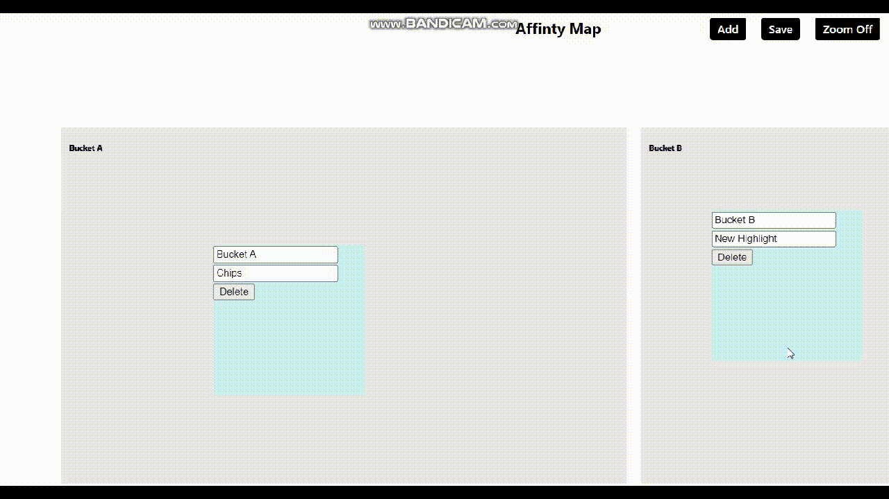

# Affinity Map - Dipit Sharma 2K19/CO/127 📋 

#### If you still have quesries about the code, please free to contact me. This project was made in a few amount of time it may lack some efficiency 👍

## Features:

    - Add/Delet/Edit Highlights 
    - Group/Move Highlights
    - Add/Delet/Edit Buckets
    - Zoom In/Out Affinity Map 

### Standard Mode

### Sorting Mode

### Grouping Highlights

## Folder Architecture (src) :

    - pages ( contains main - home page, and grouping page)
        - BucketView.js
        - Grouping.js

## To set Up On Local Machine:

    - git clone https://github.com/superstark02/affinity-map
    - npm i
    - npm start

## More information
* Hosting Link : https://afinity-map.web.app/
* Exaplaination Video : https://drive.google.com/file/d/13fF1Y_K71xic4MtGzkpUlqZb8FUqkUMX/view?usp=sharing

## I added all the features required, to my understabding. Thank you 

