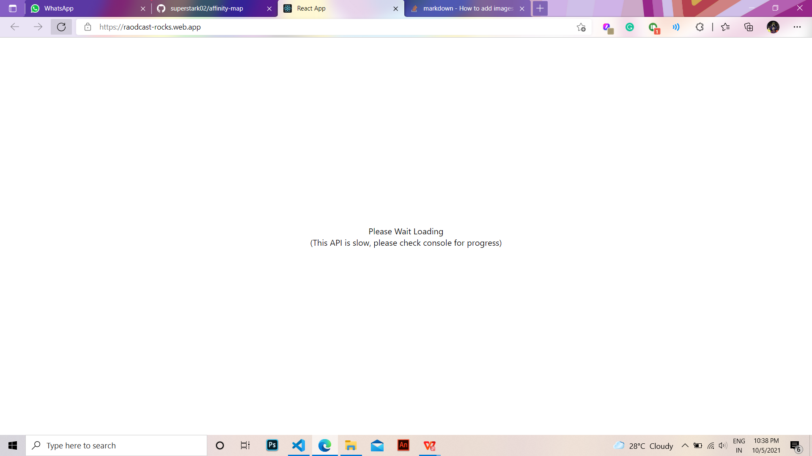
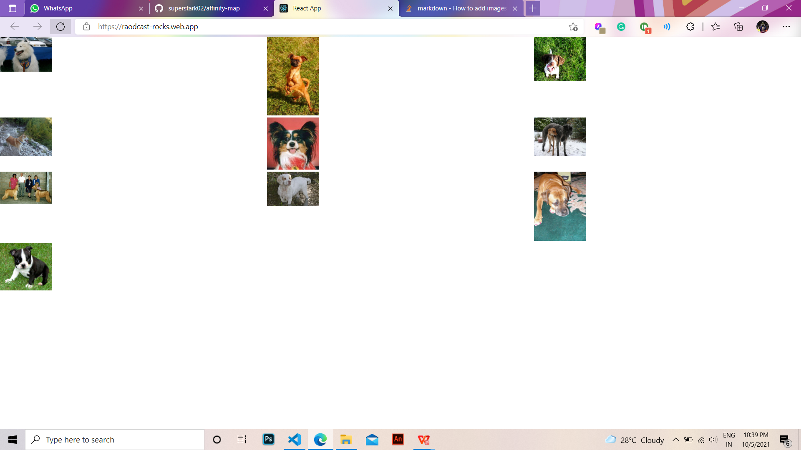

# API Calls - Dipit Sharma 2K19/CO/127 📋 

#### If you still have queries about the code, please free to contact me. This project was made in a few amount of time it may lack some efficiency 👍

## Features:
- Gets 10 random images of dogs whe nthe website is loaded
- 10 API calls are made using `for` loop
- When all data (images) is loaded, then they are rendered on the screen
- You can see in console, first 10 calls are made and images are logged, when 10 images are done, they are rendered in grid view.
- `axios` library used for GET API call

## Hosted here: https://raodcast-rocks.web.app/

## I hope added all the features required. Thank you 

